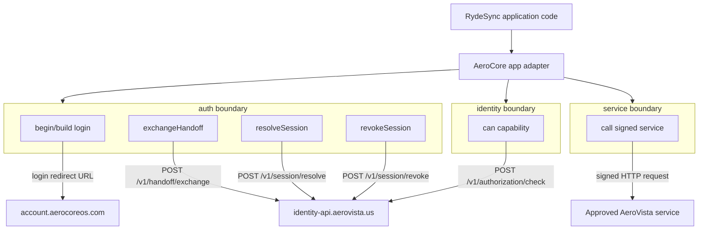
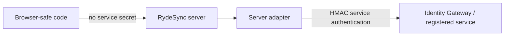
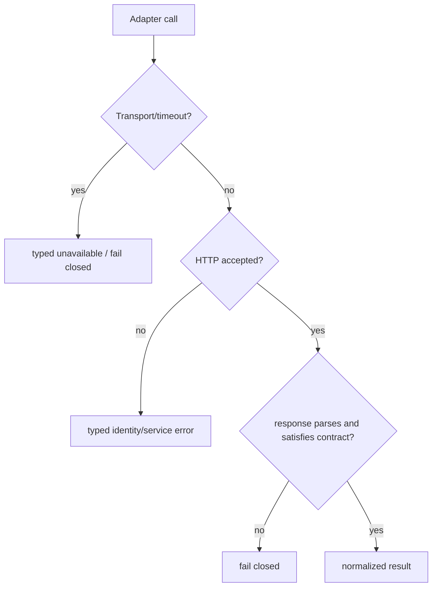

# AeroCore App Adapter — Schematic and Contract

Status: **CURRENT RydeSync bridge + canonical adapter incubation map**.  
Contract reconciled: **2026-09-01**.

RydeSync must not spread Account, Identity Gateway, AVCC, HMAC, cookie or service-secret details throughout product code. Those details live behind the app adapter boundary.

See also `PRODUCTION_ACCEPTANCE_2026-09-01.md` for the field-accepted relying-party/Account/TURN checkpoint.

## Current bridge

RydeSync runtime source:

```text
apps/api/lib/aerocore-app-adapter.js
```

Accepted Alpha.7 runtime SHA:

```text
21012670ad4452bd86d1a7e7aaa2e777d60fb061
```

Canonical TypeScript package under incubation:

```text
aerovista-us/ACOS
  branch: feat/aerocore-app-adapter-v0
  path: packages/aerocore-app-adapter
```

The JavaScript bridge intentionally matches the TypeScript package wire semantics so RydeSync can migrate to the shared package without changing its application-domain calls. The current bridge is not removed merely because the shared source exists; publication/consumption plus contract acceptance must happen first.

## Adapter ownership rule

```text
Application/domain code
        |
        v
AeroCore App Adapter
        |
        +-- Account navigation / relying-party handoff
        +-- Identity Gateway broker calls
        +-- live capability checks
        +-- registered server-to-server service calls
        |
        v
Owning authority
```

**Applications integrate to the adapter; the adapter integrates to registered authorities; authority remains with the owning service.**

Room role, playback state, location, PTT floor ownership and other RydeSync domain state remain owned by RydeSync rather than being pushed into Identity/Account.

## API map



## Trust boundary



The browser side may construct safe login/navigation information and make same-origin app calls, but service secrets and HMAC signing belong only on the application server. Never bundle `AV_IDENTITY_SERVICE_SECRET` into web assets or Android APKs.

## Relying-party login contract

Current RydeSync browser login begins at:

```text
GET /auth/login
```

RydeSync creates a random state value, stores the corresponding short-lived HttpOnly/Secure/SameSite=Lax state cookie, and redirects to Account with:

```text
client_id=rydesync
return_to=https://rydesync.aerovista.us/auth/callback
state=<random state>
```

Staff SSO may then traverse the Cloudflare Access-protected AVCC handoff route. AVCC validates the registered client and exact redirect origin before issuing a short-lived, one-time, audience-bound code. RydeSync consumes that code server-side through Identity Gateway; it is never treated as a durable browser credential.

Registered origin:

```text
rydesync -> https://rydesync.aerovista.us
```

## HMAC contract — v0.1 implementation truth

The implemented v0.1 contract in both:

```text
RydeSync apps/api/lib/aerocore-app-adapter.js
ACOS packages/aerocore-app-adapter/src/hmac.ts
```

canonicalizes the URL to its **pathname only**.

Canonical string:

```text
METHOD\nPATHNAME\nTIMESTAMP\nRAW_BODY
```

Signature:

```text
HMAC-SHA256(service_secret, canonical_string)
```

Headers:

```text
X-AV-Service: <APP/SERVICE ID>
X-AV-Timestamp: <ISO-8601 UTC>
X-AV-Signature: <lowercase hex SHA-256 HMAC>
Content-Type: application/json   # when a body is present
```

The exact serialized body sent on the wire must be the body used for the signature.

**Important reconciliation:** older documentation said `PATH_WITH_QUERY` / `pathname + query`. That description is stale and contradicts both current implementations. Do not silently change signing semantics to include query parameters without a deliberate contract version change, producer/consumer migration, and tests.

## Failure model



The adapter is not an authorization cache. Capability-sensitive actions must be able to reach the live Identity/AVCC authority; stale or unverifiable capability state is not converted into allow.

The current RydeSync bridge applies a bounded request timeout and preserves HTTP status, service error code and correlation ID when present.

## RydeSync configuration

Current Alpha.7 production shape uses:

```env
AV_IDENTITY_APP_ID=rydesync
AV_ACCOUNT_LOGIN_URL=https://account.aerocoreos.com/login
AV_IDENTITY_GATEWAY_ORIGIN=https://identity-api.aerovista.us
AV_IDENTITY_SERVICE_SECRET=<server-only secret>
```

The adapter owns the broker route mapping. Older `AV_HANDOFF_EXCHANGE_URL=<guess>` documentation is obsolete and should not be revived.

## Method contracts

### Login construction / `auth.beginLogin`

The shared-package shape exposes the browser-safe login concept as `auth.beginLogin`; the current zero-build RydeSync bridge uses `buildAccountLoginUrl(...)` for the same wire parameters. No service token is issued to browser code by this operation.

### `auth.exchangeHandoff`

Consumes the short-lived one-time handoff code server-side at:

```text
POST /v1/handoff/exchange
```

The request is service-authenticated by HMAC.

### `auth.resolveSession`

Resolves a previously returned Identity session/verifier through:

```text
POST /v1/session/resolve
```

This prevents a locally cached principal from becoming a permanent authorization source.

### `auth.revokeSession`

Calls:

```text
POST /v1/session/revoke
```

and the relying application removes/invalidates its corresponding local session state.

### `identity.can`

Calls:

```text
POST /v1/authorization/check
```

RydeSync uses it for explicit capability decisions such as `echoverse.library.listen`. `staff` or `member` classification alone does not imply the grant.

### `services.call`

Signs a server-to-server request using the same service HMAC contract. It must not turn arbitrary browser input into a signed SSRF primitive; destination policy/allowlisting remains required above the generic call primitive.

## Contract verification

RydeSync carries a dedicated `Alpha7 Adapter Contract` workflow. Pull requests targeting the Alpha.7 integration line or `main` run the full Node 22 test suite and production Compose validation. Adapter/identity behavior is also covered by the synthetic identity acceptance matrix.

Production field acceptance on 2026-09-01 additionally proved the real Account/staff-SSO → RydeSync relying-party handoff path using ACOS SHA:

```text
9f2b68842b42154349d0fc247b2e1ff9c9addad9
```

## Migration path

```text
CURRENT
RydeSync apps/api/lib/aerocore-app-adapter.js

        contract-compatible wire semantics
                     |
                     v
CANONICAL SHARED PACKAGE INCUBATION
ACOS packages/aerocore-app-adapter
branch feat/aerocore-app-adapter-v0

                     |
                     v
TARGET
published/consumable @aerovista/app-adapter-style package
```

Do not delete the local RydeSync bridge until the shared package is merged/published/consumable and the same Alpha.7 adapter/identity contract gates pass against it.
