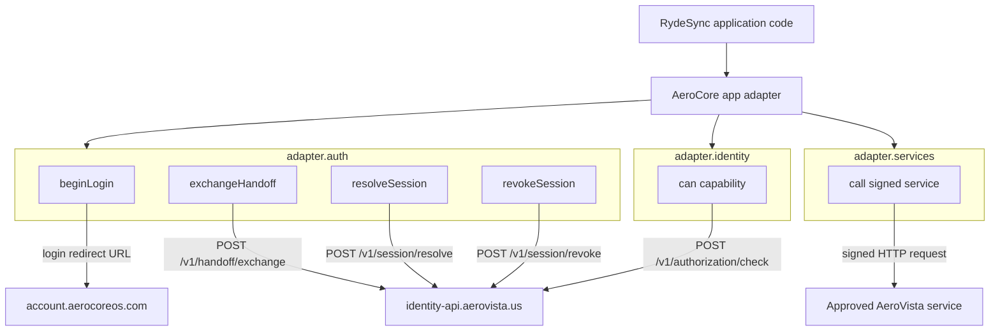
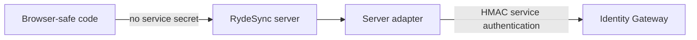
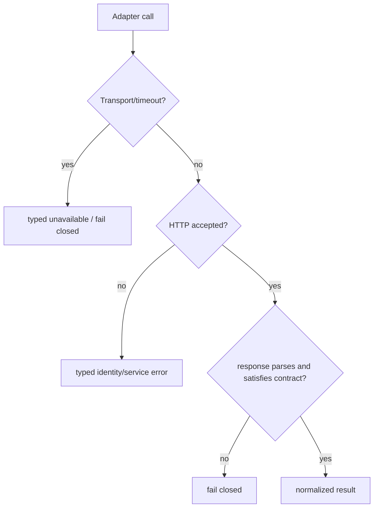

# AeroCore App Adapter — Schematic and Contract

Status: **CURRENT RydeSync bridge + canonical adapter incubation map**.

RydeSync must not spread Account, Identity Gateway, AVCC, HMAC, cookie or service-secret details throughout product code. Those details live behind the app adapter boundary.

## Current bridge

RydeSync runtime source:

```text
apps/api/lib/aerocore-app-adapter.js
```

Canonical TypeScript package under incubation:

```text
aerovista-us/ACOS
  branch: feat/aerocore-app-adapter-v0
  path: packages/aerocore-app-adapter
```

The JavaScript bridge intentionally matches the TypeScript package shape so RydeSync can migrate to the shared package without changing its application-domain calls.

## API map



## Trust boundary



The browser adapter may construct safe login/navigation information, but service secrets and HMAC signing belong only on the server. Never bundle `AV_IDENTITY_SERVICE_SECRET` into web assets or Android APKs.

## HMAC contract

Canonical string:

```text
METHOD\nPATH_WITH_QUERY\nTIMESTAMP\nRAW_BODY
```

Signature:

```text
HMAC-SHA256(service_secret, canonical_string)
```

Headers:

```text
X-AV-Service: <APP/SERVICE ID>
X-AV-Timestamp: <ISO-8601 UTC>
X-AV-Signature: <lowercase hex SHA-256 HMAC>
Content-Type: application/json
```

For absolute service URLs the canonical path is URL pathname plus query string. The exact raw body used on the wire must be the body used for the signature.

## Failure model



The adapter is not an authorization cache. Capability-sensitive actions must be able to reach the live Identity/AVCC authority; stale or unverifiable capability state is not converted into allow.

## RydeSync configuration

Current Alpha.7 production shape uses:

```env
AV_IDENTITY_APP_ID=rydesync
AV_ACCOUNT_LOGIN_URL=https://account.aerocoreos.com/login
AV_IDENTITY_GATEWAY_ORIGIN=https://identity-api.aerovista.us
AV_IDENTITY_SERVICE_SECRET=<server-only secret>
```

The adapter owns route mapping. Older `AV_HANDOFF_EXCHANGE_URL=<guess>` documentation is obsolete and should not be revived.

## Method contracts

### `auth.beginLogin`
Builds the Account login URL with the relying-party identifiers, `return_to`, `state` and other supported parameters. No token is issued to the browser by the adapter.

### `auth.exchangeHandoff`
Consumes the short-lived one-time handoff code server-side at `/v1/handoff/exchange`. The request is service-authenticated by HMAC.

### `auth.resolveSession`
Resolves a previously returned Identity session/verifier through `/v1/session/resolve`. Used to prevent a locally cached principal from becoming a permanent authorization source.

### `auth.revokeSession`
Calls `/v1/session/revoke` and removes/invalidates the app's local session state.

### `identity.can`
Calls `/v1/authorization/check`. RydeSync uses it for explicit capability decisions such as `echoverse.library.listen`.

### `services.call`
Signs a server-to-server request to an allowed absolute HTTP(S) endpoint using the same service HMAC contract. It does not turn arbitrary browser input into a signed SSRF primitive; callers must retain destination allowlisting/policy.

## Migration path

```text
CURRENT
RydeSync apps/api/lib/aerocore-app-adapter.js

        contract-compatible
               |
               v
CANONICAL SHARED PACKAGE INCUBATION
ACOS packages/aerocore-app-adapter
branch feat/aerocore-app-adapter-v0

               |
               v
TARGET
published/consumable @aerovista app-adapter package
```

Do not delete the local RydeSync bridge until the shared package is merged/published/consumable and the same Alpha.7 adapter contract tests pass against it.
