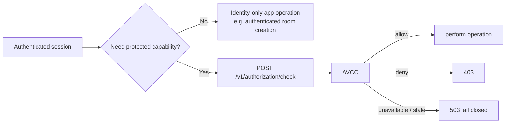

# AeroVista Identity Stack — RydeSync View

Status: **CURRENT architecture** unless a box is explicitly marked FUTURE.

## Governing rule

> **Account proves identity. Identity/AVCC grants capability. Apps enforce capability.**

Room role is a fourth boundary: even an authenticated/capability-bearing member does not automatically control a Ryde.

## Current identity lanes

```mermaid
flowchart TB
  subgraph PUBLIC[Public/customer identity lane]
    USER[Member/customer]
    ACCOUNT[account.aerocoreos.com]
    FIREBASE[Firebase / Google / password identity proof]
    USER --> ACCOUNT --> FIREBASE
  end

  subgraph STAFF[Staff/member SSO lane]
    STAFFUSER[Staff/member]
    LOGIN[login.aerocoreos.com]
    CFA[Cloudflare Access]
    AUTHENTIK[Authentik]
    STAFFUSER --> LOGIN --> CFA --> AUTHENTIK
  end

  subgraph AUTHORITY[Canonical AeroVista authority]
    IDGW[Identity Gateway\nidentity-api.aerovista.us]
    AVCC[AVCC\nidentity + authorization authority]
  end

  subgraph APP[RydeSync relying party]
    RLOGIN[/auth/login]
    CALLBACK[/auth/callback]
    ADAPTER[AeroCore app adapter]
    COOKIE[encrypted HttpOnly __session]
    PROTECTED[protected RydeSync operations]
  end

  FIREBASE -->|canonical bootstrap/session| IDGW
  AUTHENTIK -->|stable subject / staff SSO| AVCC
  LOGIN -->|resume public app handoff after staff SSO| ACCOUNT

  RLOGIN -->|client_id=rydesync, return_to, state| ACCOUNT
  ACCOUNT -->|short-lived one-time code + state| CALLBACK
  CALLBACK --> ADAPTER
  ADAPTER -->|HMAC POST /v1/handoff/exchange| IDGW
  IDGW --> AVCC
  IDGW -->|normalized session result| ADAPTER
  ADAPTER --> COOKIE
  COOKIE --> PROTECTED
  PROTECTED -->|authorization/check| ADAPTER
  ADAPTER --> IDGW
  IDGW -->|live capability decision| AVCC
```

The public Account site does not turn staff into a second public-account identity. Staff are redirected/resumed through the staff SSO lane; the app receives the same relying-party handoff shape after identity has converged.

## RydeSync handoff sequence

```mermaid
sequenceDiagram
  participant B as Browser
  participant R as RydeSync
  participant A as Account
  participant I as Identity Gateway
  participant V as AVCC

  B->>R: GET /auth/login
  R-->>B: Set HttpOnly state cookie + redirect
  B->>A: login?client_id=rydesync&return_to=...&state=...
  A->>A: authenticate / staff SSO resume if needed
  A-->>B: redirect /auth/callback?code=ONE_TIME&state=...
  B->>R: callback code + state
  R->>R: verify state
  R->>I: HMAC POST /v1/handoff/exchange
  I->>V: validate/resolve identity and relying-party handoff
  V-->>I: canonical identity/session authority
  I-->>R: normalized exchange result
  R-->>B: encrypted HttpOnly __session; redirect clean URL
```

No Firebase token, AVCC token, service secret, or reusable identity credential belongs in the redirect URL.

## Current Identity Gateway broker routes used by RydeSync

Canonical source: `aerovista-us/ACOS`, `main`, `services/identity-gateway`.

| Method | Route | RydeSync purpose |
|---|---|---|
| `POST` | `/v1/handoff/exchange` | Consume the Account one-time handoff code server-side |
| `POST` | `/v1/session/resolve` | Resolve/refresh the local app session against authority |
| `POST` | `/v1/session/revoke` | Revoke/logout the app session |
| `POST` | `/v1/authorization/check` | Live capability decision, including `echoverse.library.listen` |

Identity Gateway also retains its public Firebase/account endpoints such as `/v1/bootstrap`, `/v1/me`, `/v1/me/access`, recovery, verification resend and logout-all.

## Capability convergence



`echoverse.library.listen` is not inferred from `staff`, `member`, membership plan, or room ownership. The synthetic matrix explicitly proves staff/member allow and deny pairs plus live revocation.

## `member-access` / staff acceptance side lane

This is related identity infrastructure, not the RydeSync public handoff itself.

```mermaid
flowchart LR
  B[Browser] --> CFA[Cloudflare Access]
  CFA --> AUTH[Authentik]
  AUTH --> JWT[Cf-Access-Jwt-Assertion]
  JWT --> MA[@aerovista/member-access]
  MA -->|HMAC /api/internal/identity/resolve| AVCC[AVCC]
  MA --> PROBE[member-probe.aerocoreos.com]
```

`@aerovista/member-access` validates the Access JWT through JWKS/issuer/audience, prefers Authentik's stable `custom.sub`, resolves through AVCC, and optionally requires an explicit grant. `member-auth-probe` is a throwaway acceptance harness for this lane.

## Source authority

- **Canonical production Identity Gateway source:** `aerovista-us/ACOS` → `main` → `services/identity-gateway`.
- **Deployment owner:** `aerovista-us/nxcore` → operational `master` → `ops/tools/deploy-identity-gateway.sh`.
- **Live service path:** `/srv/ACOS/services/identity-gateway`.
- **Public origin:** `https://identity-api.aerovista.us`.
- **Standalone `aerovista-us/identity-gateway`:** extracted/reference/test mirror; **not production source of truth**.
- **Shared staff middleware:** `aerovista-us/member-access`.
- **Acceptance harness:** `aerovista-us/member-auth-probe` / `member-probe.aerocoreos.com`.

## FUTURE target, not current behavior

A future simplification may place a public handoff-exchange facade under Account while Identity/AVCC remains the authorization authority. That is a target architecture only. Current RydeSync server exchange is with the canonical Identity Gateway broker route above.
