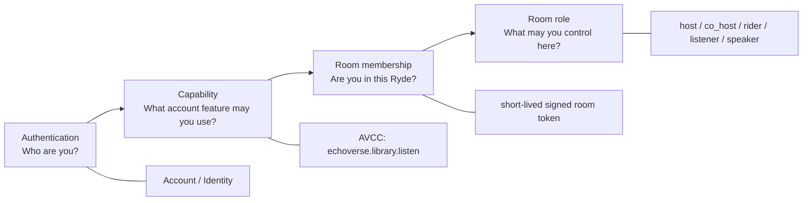
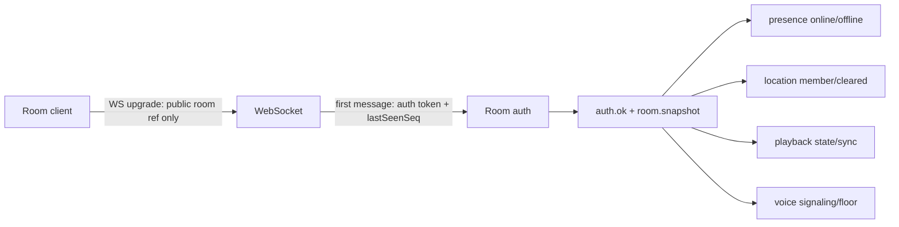
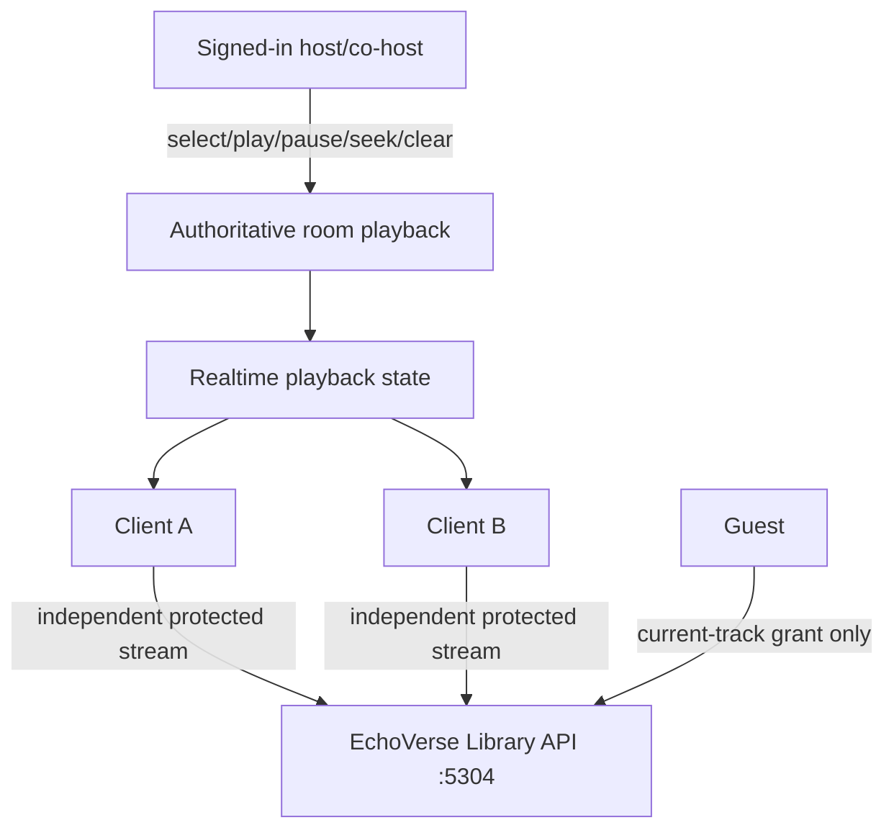
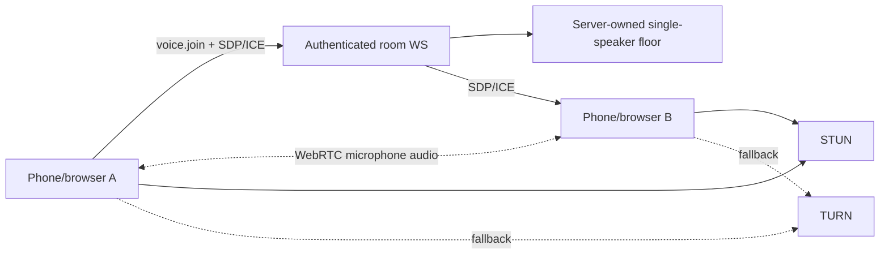

# RydeSync — Full System Schematic

Status: **CURRENT / canonical Alpha.7 architecture**. This map separates deployed runtime truth from repository/source ownership. See `SOURCE_AND_PRODUCTION_MAP.md` for exact locations and SHAs.

## Product boundary

RydeSync is a public ride-room application. Guests can join without AeroVista credentials. Signed-in members can host. EchoVerse library browsing is a separate live capability check. Room authority is separate again: shared playback mutation requires host/co-host room role.

```mermaid
flowchart TB
  subgraph CLIENTS[Clients]
    WEB[Web browser]
    ANDROID[Android / Media3 client]
    GUEST[Guest rider]
    MEMBER[Signed-in AeroVista member]
  end

  subgraph EDGE[Public edge]
    DNS[rydesync.aerovista.us]
    CF[Cloudflare]
    TUNNEL[Cloudflare Tunnel]
  end

  subgraph RYDE[RydeSync 3.0.0-alpha.7]
    UI[Web UI]
    API[Node HTTP API]
    RT[/v1/realtime WebSocket]
    ROOM[Ephemeral RoomStore]
    HUB[RealtimeHub]
    PLAYBACK[Server-authoritative playback state]
    LOCATION[Ephemeral opt-in location]
    VOICE[PTT signaling + talk floor]
    SESSION[Encrypted HttpOnly __session]
    MEDIA[Short-lived room/member media grants]
    ADAPTER[AeroCore app adapter bridge]
  end

  subgraph IDENTITY[AeroVista identity/control plane]
    ACCOUNT[account.aerocoreos.com]
    STAFFLOGIN[login.aerocoreos.com]
    IDGW[identity-api.aerovista.us]
    AVCC[AVCC authorization authority]
  end

  subgraph ECHO[Private EchoVerse]
    LIB[echoverse-library-api:5304]
  end

  subgraph VOICEINFRA[Voice infrastructure]
    STUN[STUN configured]
    TURN[TURN relay\nCURRENT: not configured]
  end

  WEB --> DNS --> CF --> TUNNEL --> UI
  ANDROID --> DNS
  UI --> API
  API --> RT
  API --> ROOM
  RT --> HUB
  HUB --> LOCATION
  HUB --> PLAYBACK
  HUB --> VOICE

  GUEST -->|Join public Ryde| API
  MEMBER -->|Start / Join Ryde| API

  API -->|room/member HMAC token| ROOM
  API --> MEDIA
  MEDIA -->|current-track-only guest grant or authorized member grant| LIB
  API -->|catalog/audio/file after authorization| LIB

  API --> ADAPTER
  ADAPTER -->|begin login| ACCOUNT
  ACCOUNT -->|one-time client/audience-bound code| API
  ADAPTER -->|handoff exchange / session resolve / revoke / authorization check| IDGW
  IDGW --> AVCC
  STAFFLOGIN --> AVCC

  API --> SESSION
  SESSION -->|principal used for protected requests| API

  VOICE -->|SDP + ICE only| RT
  WEB -. WebRTC audio .-> WEB
  VOICE --> STUN
  VOICE -. relay when configured .-> TURN
```

## Authorization layers



**Invariant:** staff/member labels do not automatically grant EchoVerse. `staff01` and `member01` pass because the capability is true; `staff02` and `member02` fail because it is false.

## Entry flows

### Guest

```text
public page
  -> Join Ryde
  -> room code
  -> guest room membership
  -> signed short-lived room token
  -> realtime auth after WebSocket open
  -> presence / opt-in location / permitted PTT
  -> current shared track only through room-scoped media grant
```

Guests cannot create/host rooms, browse the EchoVerse library, or inherit a host's account entitlement.

### Member

```text
Sign In
  -> account.aerocoreos.com/login
  -> identity proof
  -> one-time handoff code + state
  -> /auth/callback
  -> SERVER-SIDE HMAC exchange at identity-api.aerovista.us/v1/handoff/exchange
  -> encrypted HttpOnly __session
  -> authenticated Start Ryde
```

Protected capability request:

```text
RydeSync
  -> adapter identity.can("echoverse.library.listen")
  -> POST /v1/authorization/check
  -> Identity Gateway
  -> AVCC live authorization
  -> allow / deny / unavailable
```

Fail-closed behavior is deliberate: explicit deny is 403; unavailable/stale capability authority does not become allow.

## Realtime room plane



The room bearer token is intentionally not placed in invite URLs or WebSocket query parameters. Reconnect sends an authoritative snapshot; durable event replay is not yet claimed.

## Shared EchoVerse playback



RydeSync synchronizes control state, not audio bytes. Playback epochs reject stale controller writes. Member catalog browse requires live `echoverse.library.listen`; guest current-track listening does not.

## Push-to-talk



Current observed production UI: **PTT Ready**, **TURN not configured**. STUN/same-network or easy-NAT voice may work; reliable independent-cellular operation is not accepted until TURN is deployed and the two-phone field test passes. Cloudflare Tunnel is not TURN.

## Privacy and durability

- Location is explicit opt-in and memory-only.
- Location clears on stop, disconnect, staleness, or room expiry.
- Microphone capture is explicit opt-in; audio is WebRTC media and is never written into room state.
- Rooms, membership, playback, location, sequence and voice-floor state are process-memory state in Alpha.7.
- A server restart ends active Rydes.
- Redis/Postgres durability and multi-instance coordination remain later hardening work.

## Deployment topology

```text
PUBLIC https://rydesync.aerovista.us
  Cloudflare Tunnel
    -> 127.0.0.1:8080
       -> production RydeSync container :9000

BETA / prior validation lane
    host :9001

LEGACY / trial lane
    host :9000

Private dependency
    echoverse-library-api:5304 on reachable Docker network
```

The exact source/deployed SHAs, live paths, secrets paths and deployment ownership are maintained in `SOURCE_AND_PRODUCTION_MAP.md`.
